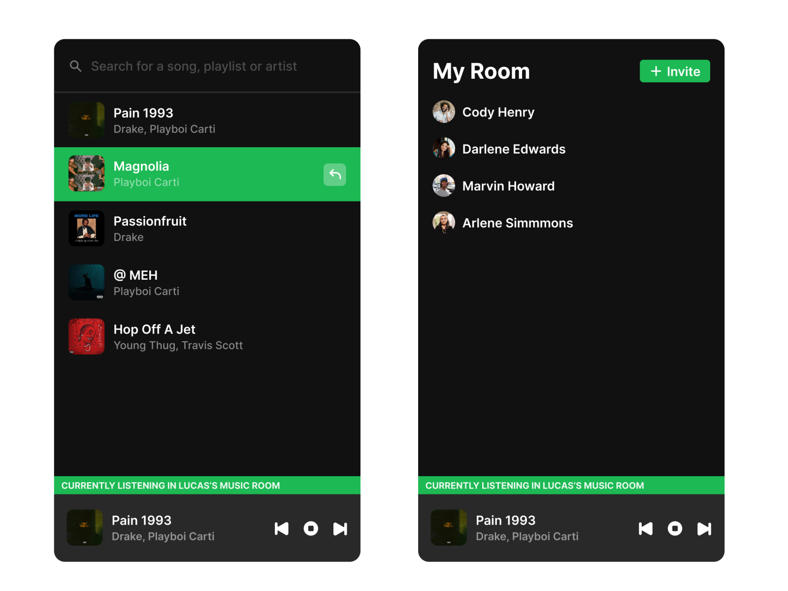

# Tunedin

Project stopped beacuse playing spotify in electron is impossible without a (Widevine DRM)[https://www.widevine.com/solutions/widevine-drm]

Tunedin is a electron app for listening to spotify in a group.



Figma File:
https://www.figma.com/file/IY3FuR9Mk8XIOBL1lhO9hj/Tunedin?node-id=0%3A1

## Installation

### Frontend

```bash
# Install dependencies
yarn install

# Starts up webpack and runs electron app
yarn start
```

### API

```bash
# Install dependencies
mix deps.get

# Source env variables to the enviorment
source .env

# Run server within iex enviorment
iex -S mix phx.server
```

## Contributing

Pull requests are welcome. For major changes, please open an issue first to
discuss what you would like to change.

## License

[MIT](https://choosealicense.com/licenses/mit/)
